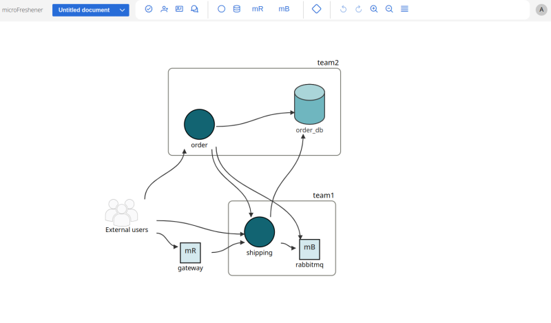
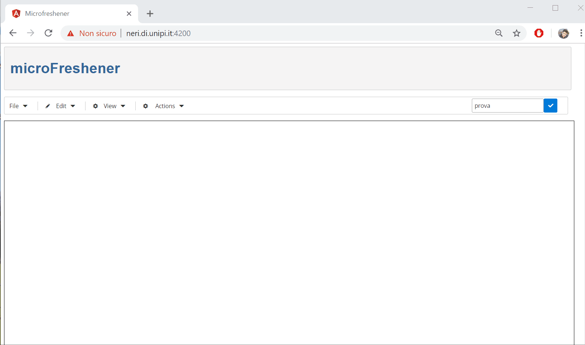

# MicroFreshener

MicroFreshener is a web-based prototype that enables to identify bad architectural smells that possibly violate principles of microservices, and to select suitable refactorings to resolve them.



## Table of Contents
- [MicroFreshener](#microfreshener-architecture)
  * [GUI](#web-based-interface)
  <!-- * [Internal architecture](#internal-architecture) -->
- [Quick Guide](#quick-guide)
  * [Installation](#installation)
  <!-- * [Example of usage](#example-of-usage) -->
- [License](#license)

## Web-based interface
`MicroFreshener` has a web-based interface that allows to:
- Draw and edit the architectures of microservices
- Manage teams and their owned nodes
- Analyse the architecture to identify architectural smells
- Apply refactorings

`MicroFreshener` can be used either as `admin` or `team member`.
- You can login as administrator by typing `admin` in the login page
- You can login as a team member by typing the _exact_ name of your team in the login page


<!--Examples of the web-based interface is shown below.
-->

## Quick Guide
In order to run `MicroFreshener` you should run both the server and the client (for local use only).

## Installation
In order to use `MicroFreshener` you should first download the repository:

```bash
git clone https://github.com/di-unipi-socc/microFreshener.git
```

### Run the server
Enter the server directory.

```bash
cd server
```

Create a virtual environment and install the Python dependencies. Python3.8+ is needed.

```bash
virtualenv -p="/usr/bin/python3.8" venv  
source venv/bin/activate 
pip install -r requirements.txt 
```

If you're using Windows, type this instead.

```bash
python -m venv venv  
Set-ExecutionPolicy Unrestricted -Scope Process
.\venv\Scripts\Activate.ps1
pip install -r requirements.txt
```

Apply migrations (if this doesn't work, try running it after you already run the server once)

```bash
python manage.py migrate

```

Run the local server

```bash
python manage.py runserver

// expose the server to a specific port
python manage.py runserver 0.0.0.0:8000

```

###  Run the client
The client is an Angular web application.

```bash
cd client
```

Install the project dependencies.

```bash
npm install
```

Then, serve the client with a local server by typing

```bash
sudo ng serve
```
or
```bash
sudo npm start
```

[comment]: <> (// deploy on production host "neri.di.unipi.it")
[comment]: <> (ng serve --host neri.di.unipi.it -c production)

In case of `ERR_OSSL_EVP_UNSUPPORTED` error, type `export NODE_OPTIONS=--openssl-legacy-provider` before `ng serve`.

Open the bowser on http://localhost:4200/.


## Install MicroFreshener using Docker compose

Make sure to install the following dependencies:

```bash
pip install websocket
pip install docopt
pip install texttable
pip install dockerpty
pip install websocket-client
```

Create the docker network
```bash
docker network create web
```
Build the image

```bash
docker-compose -f docker-compose.prod.yml build
```

```bash
docker-compose -f docker-compose.prod.yml up
```

Open the bowser on http://localhost:80.
